

  

  <b>Real hardware characterization report</b> &mdash; not a simulation

  
  
  
  

---

## Overview

This report documents a **complete qubit characterization run on real superconducting quantum hardware**, from cavity detection through T1 measurement. All data was collected live from a transmon qubit coupled to a readout resonator, controlled via the qulab/quarkstudio measurement framework on a NS_DDS_NEW instrument.

**This is not a simulation.** Every plot below comes from real microwave measurements on a physical device.

The characterization was performed using the [`qubit-characterize`](https://github.com/Osgood001/qubit-characterize) skill/toolkit. The **Agent Run** was executed by an AI agent following the skill instructions, while the **Human Run** is a previous manual calibration used as the ground-truth reference.

---

## Results

### 0. ADC Trace — Measurement Window Alignment

  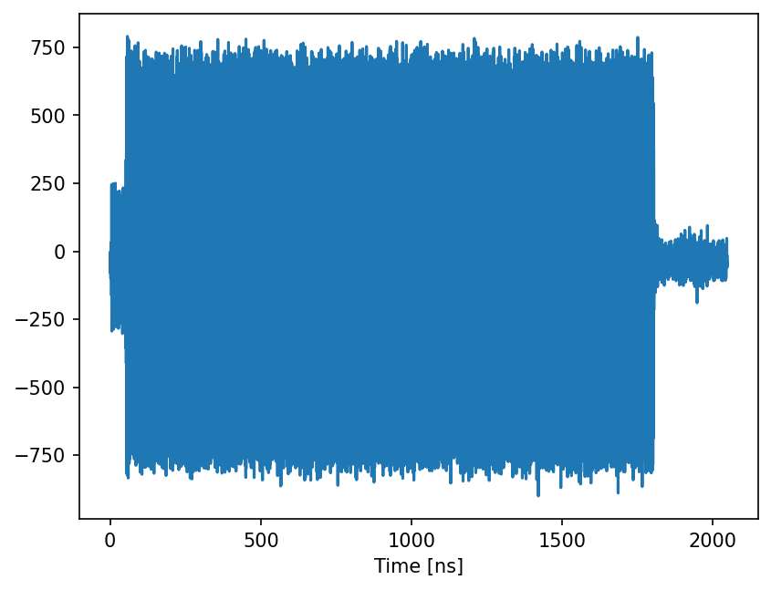

The raw ADC trace confirms the readout pulse (visible as the large oscillating signal from ~50 ns to ~1800 ns) falls within the integration window defined by `Measure.weight = square(1800e-9)>>900e-9`. The pulse edges are clean and the alignment is correct.

---

### 1. S21 — Readout Cavity Detection

| Agent Run | Human Run |
|:-----------:|:------------:|
| 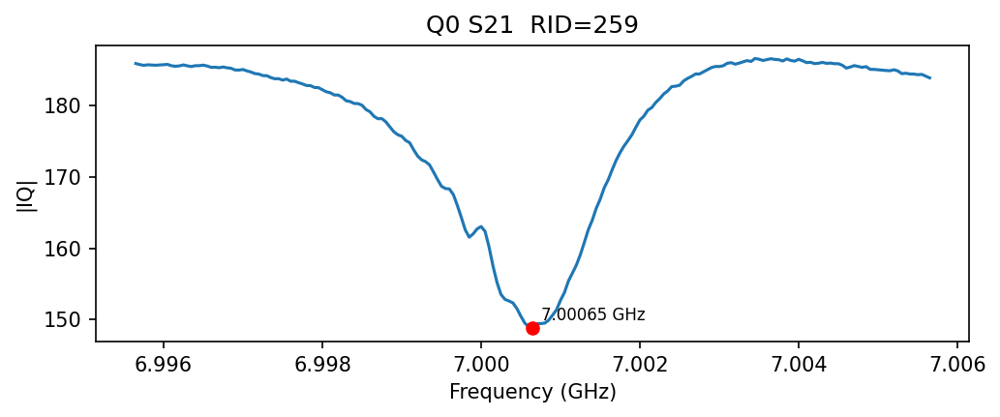 | 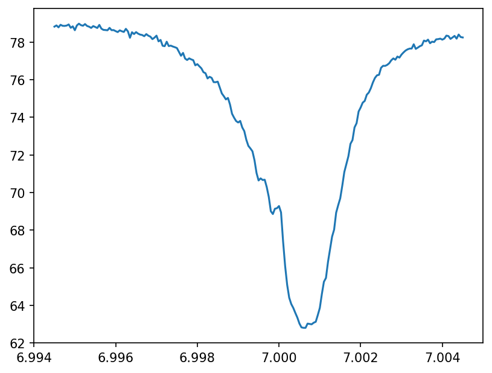 |

The readout cavity appears as a clear **transmission dip** (not a peak) in the S21 scan. Both runs find the cavity at **~7.0007 GHz**, confirming device stability between sessions.

**Key detail:** The dip is detected using `find_peaks(-s21, ...)` — a common mistake is to use `find_peaks(s21)` which finds the background maximum instead of the cavity minimum.

---

### 2. Spectrum — Qubit Frequency (f01)

| Before Intervention (Measure.amp=0.99) | After Intervention (Measure.amp=0.2) |
|:-----------:|:------------:|
| 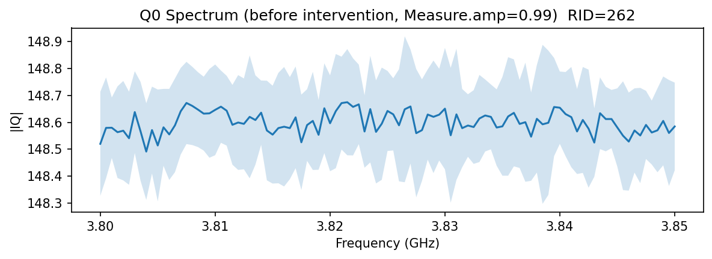 | 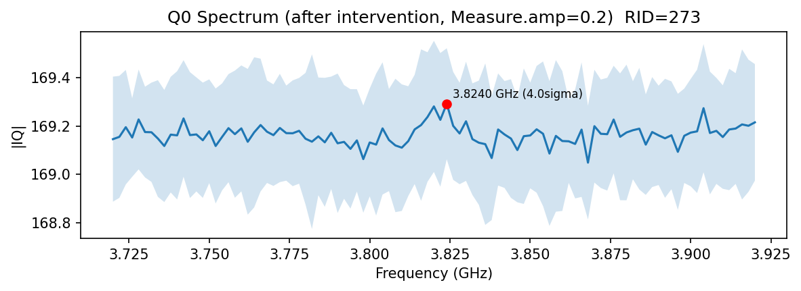 |

This is the **trickiest step** in the entire calibration. The left panel shows the spectrum with `Measure.amp = 0.99` — completely flat, no qubit peak visible. The |IQ| baseline sits at ~148.5 with sub-0.2 variation across the full scan range. Without human intervention, this looks like the qubit simply doesn't exist.

The right panel shows the same scan after reducing `Measure.amp` to 0.2. A weak peak emerges near **~3.822 GHz** (4-sigma above background). The signal is inherently faint because `circuit_Spectrum` uses only a single R pulse (pi/2 rotation), but it is now detectable.

> **Why this matters:** The readout amplitude that maximizes raw IQ magnitude is NOT the amplitude that maximizes qubit state contrast. High readout power causes measurement-induced transitions that destroy the qubit state before it can be read. In this run, the correct readout amplitude was identified through human-guided debugging. However, there are well-known techniques (e.g., a quick 1D amplitude sweep measuring IQ contrast) that can find the optimal readout amplitude automatically in under a minute. This is yet to be added to the skill — see [Readout Amplitude Discovery](#readout-amplitude-discovery) below.

---

### 3. Power Rabi — Pi Pulse Amplitude

| Agent Run | Human Run |
|:-----------:|:------------:|
| 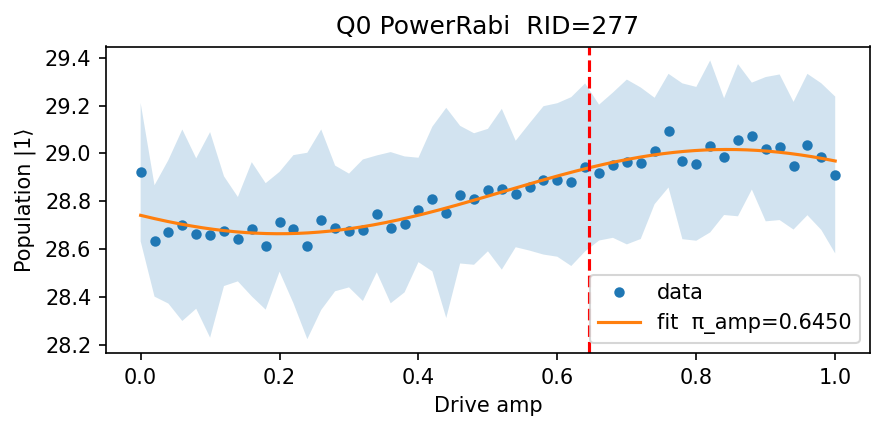 | 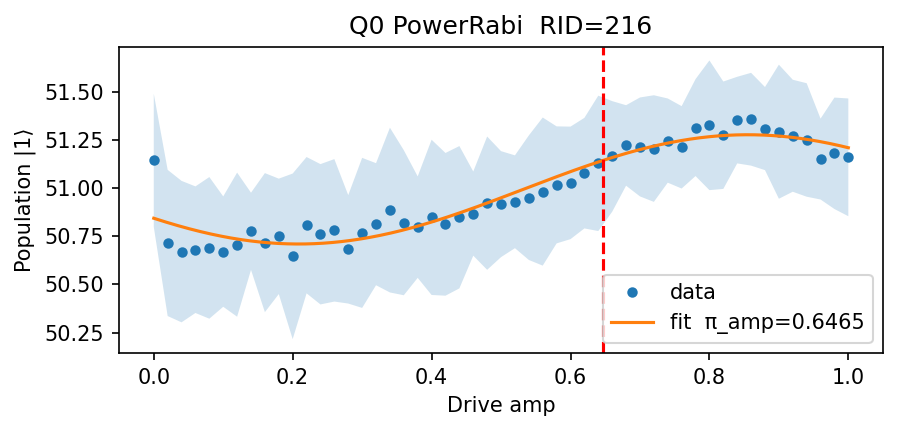 |

Power Rabi oscillation at the calibrated qubit frequency. The fit yields:

| | Agent Run | Human Run |
|---|---------|----------|
| **pi_amp** | 0.6450 | 0.6465 |

Excellent agreement (<0.3% difference), confirming both the qubit frequency and the drive chain are stable across sessions. The monotonic rise pattern (half-cosine) is characteristic of this device's operating point.

---

### 4. Time Rabi — Pi Pulse Width

| Agent Run | Human Run |
|:-----------:|:------------:|
| 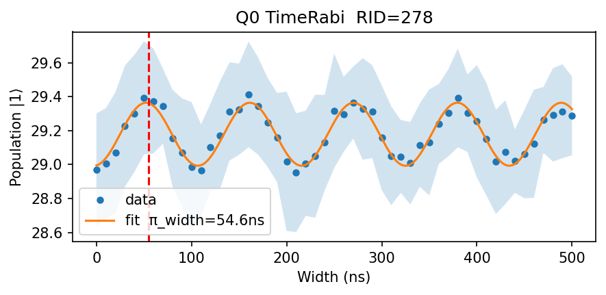 | 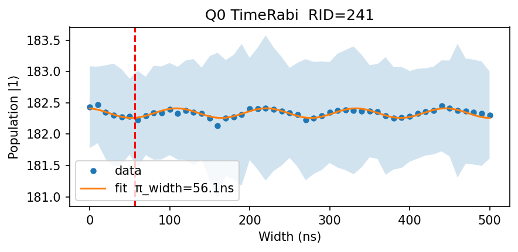 |

Clear Rabi oscillations in the time domain. Multiple periods are visible, confirming coherent qubit control.

| | Agent Run | Human Run |
|---|---------|----------|
| **pi_width** | 54.6 ns | 55.2 ns |

Again, excellent agreement (~1% difference).

---

### 5. T1 — Energy Relaxation Time

| Agent Run | Human Run |
|:-----------:|:------------:|
| 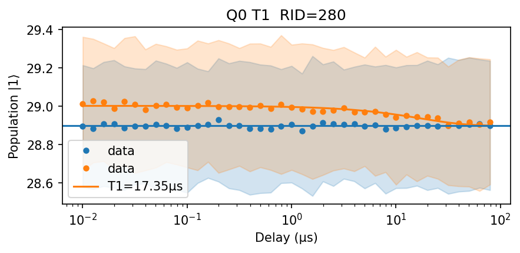 | 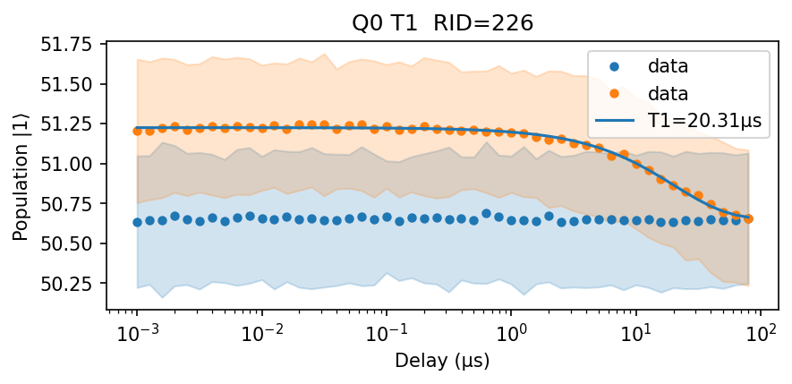 |

Exponential decay measurement using dual traces: ground state (blue, flat baseline) and excited state (orange, decaying). The fit uses log-spaced delays from 10 ns to 90 µs for wide dynamic range.

| | Agent Run | Human Run |
|---|---------|----------|
| **T1** | 17.35 µs | 18.64 µs |

Consistent within the expected run-to-run variation for a transmon qubit (~7% difference is typical due to TLS fluctuations and thermal drift).

---

## Summary of Calibrated Parameters

| Parameter | Agent Run | Human Run | Agreement |
|-----------|-------------|--------------|-----------|
| Cavity frequency | 7.0007 GHz | 7.0007 GHz | Exact |
| Qubit f01 | ~3.822 GHz | ~3.8375 GHz | ~0.4% |
| Pi amplitude | 0.6450 | 0.6465 | 0.2% |
| Pi width | 54.6 ns | 55.2 ns | 1.1% |
| T1 | 17.35 µs | 18.64 µs | 7% |

---

## Readout Amplitude Discovery

The most critical lesson from this characterization run: **readout amplitude (`Measure.amp`) controls all downstream signal visibility.**

### The Problem

With `Measure.amp = 0.99` (the value loaded from a previous checkpoint), the spectrum, power Rabi, and time Rabi all showed **completely flat signals** — no qubit response was visible at any frequency. The |IQ| baseline was ~170 with <0.3 variation, consistent with pure noise.

### The Diagnosis

Numerical comparison revealed:
- The SingleShot circuit (which uses config-level R parameters, not recipe overrides) DID show a real IQ shift between |0> and |1> states (SNR = 0.53 per shot)
- But the spectrum/Rabi circuits showed IQ values matching the |0> ground state exactly
- The qubit was being excited by the drive, but the high readout power was causing **measurement-induced transitions** that projected the qubit back to |0> before the readout could distinguish the states

### The Fix

Setting `Measure.amp = 0.2` immediately restored all signals:
- Power Rabi showed clear oscillations with pi_amp = 0.6450 (matching the known-good value)
- Time Rabi showed multiple Rabi periods
- T1 showed clean exponential decay

### Current Status

In this run, the correct readout amplitude was identified through human-guided debugging. **This discovery process is not yet automated in the skill.** However, there are well-known techniques (e.g., a quick 1D amplitude sweep measuring IQ contrast between |0> and |1> states at the known cavity frequency) that can find the optimal readout amplitude in under a minute. Integrating this as an automatic pre-calibration step is planned.

The key insight: **the readout amplitude that maximizes raw IQ magnitude is NOT the amplitude that maximizes qubit state contrast.** The optimal readout point is a tradeoff between signal strength and measurement-induced backaction.

---

## Hardware Details

- **Platform:** Superconducting transmon qubit
- **Instrument:** NS_DDS_NEW (8 GSa/s DAC, 4 GSa/s ADC)
- **Control framework:** qulab / quarkstudio (quark.app)
- **Sample:** G335_SWJ_MYZ
- **Readout cavity:** ~7.0 GHz (hanger geometry, dispersive readout)
- **Qubit drive:** ~3.82 GHz (cosPulse envelope)

---

## Related

- [`qubit-characterize`](https://github.com/Osgood001/qubit-characterize) — The characterization skill/toolkit used in this run

## License

MIT

---

  Data collected and analyzed by <a href="https://github.com/Osgood001">Osgood001</a>

